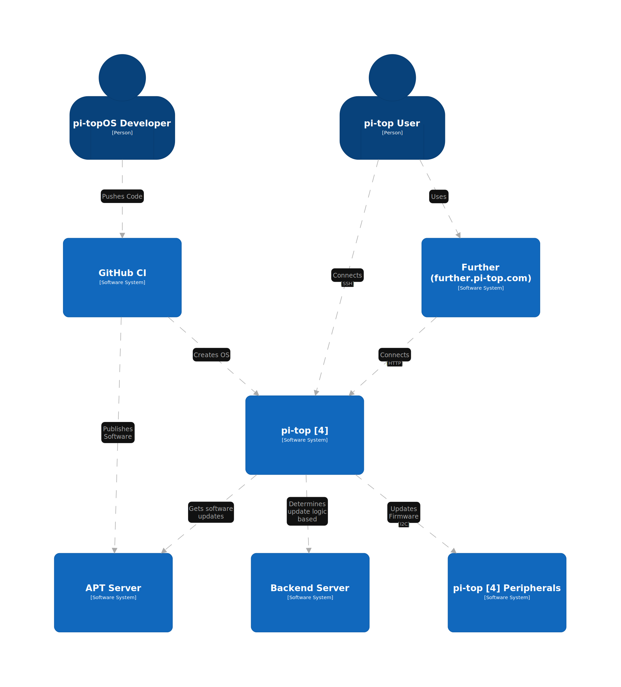
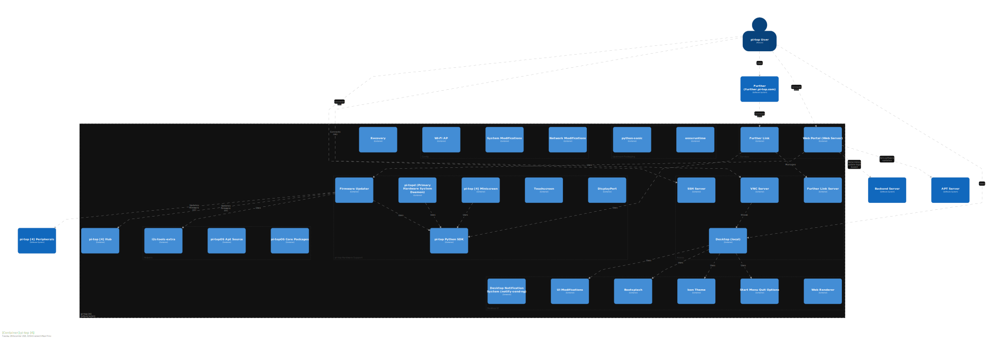

# pi-topOS C4 Model

This repository contains a Structurizr 'Diagram as Text' that represents pi-topOS, available to view via Structurizr Lite to access the DSL.

## Useful Links
* [Language Reference](https://github.com/structurizr/dsl/blob/master/docs/language-reference.md)
* [Examples](https://github.com/structurizr/dsl/tree/master/examples)

## TODO

* [Diagram Review Checklist](https://c4model.com/review/)
